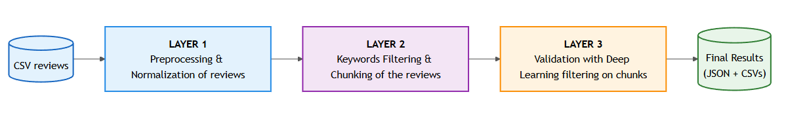
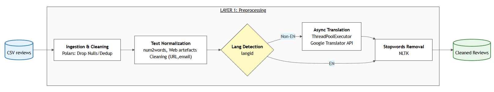
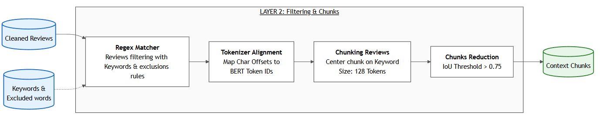
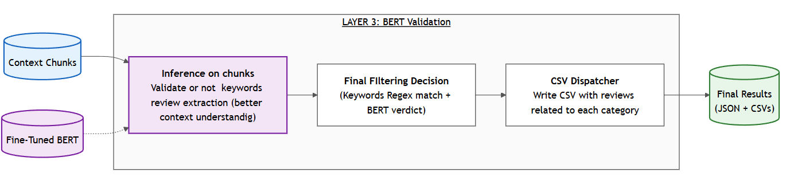
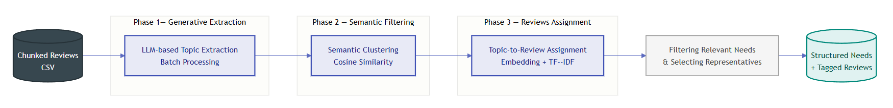

# Pipeline to identify travellers' needs from review data

## Introduction 

This repository contains the work carried out by Albin Morisseau and Emma Lhuillery as part of the Large Project in AI at the University of Klagenfurt between October 2025 and February 2026 under the supervision of Dr Markus Zanker

The aim of this project is to study the behaviors and the needs of travellers with specific needs (disabilities, pets, young children) who require special arrangements and conditions.

The following elements are available in this repository:

## 1. End-to-End Pipeline to Extract Reviews Related to Travellers’ Needs

This repository provides a **reproducible and scalable end-to-end pipeline** designed to extract travel reviews related to specific traveller needs from large, heterogeneous datasets.

The pipeline focuses on three traveller categories:
- travellers with **pets**,
- travellers with **children**,
- travellers with **disabilities**.

The main objective is to transform raw, noisy review corpora into **high-quality, semantically validated subsets** that can be reliably used for downstream analyses such as topic modelling, behavioural studies, or comparative evaluations.

To achieve this, the proposed approach combines **heuristic filtering**, **context-aware text segmentation**, and **neural semantic validation** in a multi-layer architecture.

---

### 1.1 Global Pipeline Architecture



The pipeline is structured as a **three-layer filtering funnel**, where each layer progressively refines the dataset by addressing a specific challenge:

1. Text cleaning and normalisation  
2. High-recall heuristic extraction  
3. High-precision semantic validation  

This design ensures both **robustness and interpretability**, while remaining computationally efficient for large-scale datasets.

---

### 1.2 Layer 1 — Preprocessing and Text Normalisation



The first layer prepares raw review data for reliable extraction and classification.  
It enforces a consistent textual format across datasets originating from different platforms and languages.

The main preprocessing steps include:
- Removal of reviews with missing text and duplicate entries
- Conversion of numerical values into their textual form
- Removal of special characters, URLs, email addresses, and web artefacts
- Automatic language detection and translation of non-English reviews into English

This layer significantly reduces noise and ensures that all reviews are comparable and suitable for downstream keyword matching and semantic modelling.

---

### 1.3 Layer 2 — Heuristic Keyword Filtering and Context-Aware Chunking



This layer performs an initial **high-recall extraction** of candidate reviews using curated keyword dictionaries.

#### Heuristic keyword filtering
For each traveller category, a dedicated dictionary of keywords and expressions is defined.  
A review is selected if it contains at least one keyword associated with the target category.  
An optional exclusion dictionary is used to filter out known false positives (e.g. *“hot dog”* when filtering for pets).

This step prioritises recall to avoid discarding potentially relevant reviews at an early stage.

#### Context-aware chunking
Travel reviews often contain multiple, loosely related topics. To prevent semantic dilution, the pipeline extracts **local textual contexts** around detected keywords.

For each keyword occurrence:
- the review is tokenised,
- a fixed-length window of 128 tokens centred on the keyword is extracted,
- overlapping chunks are merged using a keyword-density-based criterion.

This results in compact, semantically focused text segments that preserve the relevant context for classification.

---

### 1.4 Layer 3 — Semantic Validation Using BERT



The final layer addresses the lack of semantic understanding inherent to keyword-based methods.

Each extracted chunk is validated using a **fine-tuned BERT-based classifier**, trained to determine whether the text genuinely refers to:
- travellers with pets,
- travellers with children,
- travellers with disabilities.

A chunk is considered valid if the predicted probability for the corresponding category exceeds a fixed decision threshold.

To maximise precision, a review is included in the final dataset **only if**:
1. it passes the heuristic keyword filtering stage, and  
2. its chunk is semantically validated by the BERT model.

This strict intersection rule effectively removes false positives while preserving high recall.

---

### 1.5 Outputs 

The pipeline produces in the results/pipeline/your_original_dataset_name folder:
- one CSV file per traveller category containing semantically validated reviews,
- complementary CSV files containing non-matching reviews for comparative analyses.


## 2. **Tools for topic modelling and need extraction**

Once traveller-specific reviews have been extracted and semantically validated, the repository provides several **topic modelling tools** to analyse recurring themes, concerns, and needs within each traveller group (pets, children, disabilities), and to compare them with the general traveller population.

The objective of this stage is twofold:
- to **validate the semantic coherence** of the extracted review subsets,
- to **identify latent and explicit needs** (e.g. pet policies, accessibility conditions, family-friendly amenities).

The following complementary approaches are implemented:

### 2.1 TF–IDF Analysis
TF–IDF is used to highlight **discriminative unigrams and bigrams** that are characteristic of a given traveller group compared to the rest of the corpus (e.g. *“pet fee”*, *“accessible room”*).  
It also serves as the input representation for matrix factorisation and probabilistic topic models.

### 2.2 Non-negative Matrix Factorization (NMF)
NMF is applied to TF–IDF matrices to extract **interpretable, additive topics** expressed as clusters of co-occurring terms.  
This method is well suited for identifying clear and recurrent needs such as policies, amenities, or constraints specific to each traveller group.

### 2.3 Latent Dirichlet Allocation (LDA)
LDA provides a probabilistic topic modelling framework in which each review is represented as a mixture of latent topics.  
It enables the analysis of **topic prevalence and co-occurrence patterns**, and facilitates quantitative comparisons between constrained traveller groups and non-group reviews.

### 2.4 BERTopic
BERTopic leverages **transformer-based embeddings**, dimensionality reduction, and density-based clustering to identify topics in a semantic space rather than relying solely on word co-occurrence.  
This approach captures **nuanced and context-dependent needs**, even when similar concerns are expressed using different vocabularies.

Together, these tools offer multiple, complementary perspectives on travellers’ needs, ranging from easily interpretable keyword-based insights to embedding-driven semantic structures.

### 2.5 Need Extractor Tool

The **Need Extractor Tool** complements traditional topic modelling methods by transforming traveller review segments into explicit, actionable user needs. Unlike statistical approaches that output clusters of terms, this tool leverages a local LLM to perform semantic abstraction, producing coherent need statements from context-aware chunks of reviews.



The workflow consists of three sequential phases:

- **Generative Extraction:** Candidate needs are mined from keyword-focused review chunks using a quantized LLM. The model abstracts specific observations into general, shareable need statements while providing justifications for validity.

- **Semantic Filtering:** Redundant or overlapping needs are consolidated through embedding-based clustering, selecting representative needs for each cluster.

- **Hybrid Review Assignment:** Original review chunks are mapped to extracted needs using a combination of embedding similarity and TF–IDF matching, ensuring assignments are both semantically relevant and lexically supported.

This tool is fully local and free to use.

## Hardware

We ran the code on the following laptop hardware:
- RTX4070 GPU / 8 GB RAM
- Intel Core i9 CPU / 32 GB RAM

Please modify the NUM_THREADS environment variable in the .env file to match your CPU's capabilities to avoid overloading your hardware.

NB: We strongly recommend using more powerful hardware or cloud services to significantly speed up calculation times.

## Project Structure
```
review-pipeline/
├── data/ # Input data, configuration files (categories, exclusions)
├── images/ # Descriptive images of the pipeline architecture
├── logs/ # Pipeline logs
├── models/bert_finetuned/ # Fine-tuned BERT model and tokenizer for validation
├── results/ # folder containing the results of the pipeline and topic modelling
├── scripts/ # Standalone scripts (scraping, model downloading)
├── src/ # Core pipeline modules 
├── tests/ # Unit and integration tests
├── topic_modelling / # Contains tools to help extract topics and needs from reviews
├── .env # Environment variables
├── main.py # Main entry point for the end-to-end pipeline
├── README.md
└── requirements.txt
```

## Setup and Execution

### 2.1 Environment Setup

1. **Clone the repository:**
    ```bash
    git clone [https://github.com/AlbinMorisseau/review-pipeline.git](https://github.com/AlbinMorisseau/review-pipeline.git)
    cd review-pipeline
    ```
2. **Create and activate a virtual environment:**
    ```bash
    python -m venv venv
    # For Windows
    .\venv\Scripts\activate
    # For MacOS/Linux
    source venv/bin/activate
    ```
3. **Install dependencies:**
    ```bash
    pip install -r requirements.txt
    ```

4. **Download stop words for topic modelling:**
    ```bash
    python -m spacy download en_core_web_sm
    ```

5. **Download fine-tuned BERT model for validation:**
    ```bash
    python -m scripts/download_model.py
    ```

6. **Download Ollama models used by the Need Extractor Tool:**
    ```bash
    ollama pull mistral
    ollama pull nomic-embed-text
    ```

7. **(Optional) Launch tests:**
    ```bash
    pytest tests/
    ```

### 2.2 Configuration Files

In order to launch the pipeline effectively, it is necessary to modify the following files:

- **.env file** : Modify the global variable NUM_THREADS to suit your CPU's capabilities. 
- **data/categories.json** : You can adapt the lists of keywords associated with the three    categories of travellers to best suit the needs of your use case. If you do not necessarily have a clear idea of the results you want to achieve, we advise you not to modify them.
- **data/exclusions.json** Similarly, if you have identified words that could be problematic for the precise extraction of your reviews, you can modify the list of words that you do not want to take into account in the heuristic filtering.

If you do not want to use the pipeline for the three types of travellers, you can simply replace the list of keywords and excluded words with an empty list.

Also make sure to put your original reviews dataset in the data folder with at least a column containing the reviews and another column containing a unique id for each row.

### 2.3 Running the Pipeline

The end-to-end pipeline is executed via the `main.py` entry point and can be configured using the following command:

```bash
python main.py --input "your_input_file.csv"
```

The available command-line parameters are described below.

- **`--input` (`-i`)** **[required]**  
  Path to the input CSV file containing the original reviews.  
  The file must include at least one column containing the review text and another containing IDs.
  It is strongly advised to put it in the data folder with an explicit name.

- **`--column` (`-c`)**  
  Name of the column containing the review text in the input CSV  
  (default: `review`).

- **`--id_col`**  
  Name of the column containing unique review identifiers  
  (default: `id`).  
  This identifier is preserved throughout the pipeline to ensure traceability between input and output.

- **`--categories`**  
  Path to the JSON file defining keyword dictionaries for each traveller category  
  (default: `data/categories.json`).

- **`--exclusions`**  
  Path to the JSON file defining exclusion patterns used to remove known false positives  
  (default: `data/exclusions.json`).

- **`--model_path`**  
  Path to the directory containing the fine-tuned BERT model and tokenizer used for semantic validation  
  (default: `models/bert_finetuned`).

- **`--batch_size`**  
  Batch size used during BERT inference  
  (default: `16`).  
  This parameter can be adjusted according to available GPU or CPU memory.

- **`--threshold`**  
  Decision threshold applied to model prediction probabilities  
  (default: `0.5`).  
  Higher values increase precision at the cost of recall, while lower values favour recall.

These parameters allow the pipeline to be flexibly adapted to different datasets, review schemas, and computational constraints while preserving reproducibility.

### 2.3 Running the Need Extractor tool

The Need Extractor tool can be executed on the pipeline outputs from the project root using the following command:

```bash
python -m topic_modelling.need_extractor --input "results/pipeline/your_dataset_name/pet.csv" --category pet
```

The `--category` argument must be adapted to match your category of interest.

This category is injected into the LLM prompts to guide the extraction of context-aware and shareable user needs.

The available command-line parameters are described below.

- **`--input`** *(required)*  
  Path to the input CSV file containing the processed reviews.  
  This file is typically an output of the upstream pipeline.

- **`--text_col`**  
  Name of the column containing the textual review chunks used for need extraction.  
  **Default:** `chunk`  
  Using chunked text is recommended, as full reviews may introduce noise.

- **`--keyword_col`**  
  Column used to group reviews before LLM processing.  
  **Default:** `keywords_found`  
  If the column is missing or empty, all reviews are processed uniformly.

- **`--category`** *(required)*  
  Traveller context category used to steer the LLM extraction.  
  This parameter strongly influences the semantic framing of extracted needs.

- **`--batch_size`**  
  Number of reviews sent to the LLM per request during raw need extraction.  
  **Default:** `15`  
  Larger values reduce the number of LLM calls but may decrease precision.

- **`--sim_threshold`**  
  Similarity threshold used to merge semantically close needs during clustering.  
  **Default:** `0.5`  
  Clustering is performed using cosine distance defined as `1 − similarity`.

- **`--min_cluster_size`**  
  Minimum number of similar raw needs required for a cluster to be kept.  
  **Default:** `2`  
  Clusters below this size are discarded to avoid weak or anecdotal needs.

- **`--embed_threshold`**  
  Minimum cosine similarity required to assign a review to a need using embeddings.  
  **Default:** `0.5`

- **`--tfidf_threshold`**  
  Minimum TF-IDF similarity score used as a fallback assignment mechanism.  
  **Default:** `0.1`

- **`--min_needs_number`**  
  Minimum number of reviews that must be linked to a need for it to appear in the final summary.  
  **Default:** `6`  
  This parameter controls the selectivity of the final output.

- **`--gen_model`**  
  Ollama generation model used for need extraction.  
  **Default:** `mistral`
  Please make sure you have pulled the model you want to use.
  ```bash
  ollama pull <model_name>
  ```

- **`--embed_model`**  
  Ollama embedding model used for semantic similarity computation.  
  **Default:** `nomic-embed-text`
  Please make sure you have pulled the model you want to use.
  ```bash
  ollama pull <model_name>
  ```

All results are written to the following directory: `results/topic_modelling/needs_extraction/`

- **`reviews_needs_<category>.csv`**  
  Detailed per-review assignments including the assigned need, similarity score, and assignment method (`embedding`, `tfidf`, or `none`).

- **`needs_summary_<category>.json`**  
  Aggregated JSON summary containing the final list of needs, their frequency, and a small set of representative reviews for each need.

### 2.4 Running the Topic Modelling Toolkit

A Jupyter notebook is provided in the `topic_modelling` folder. It allows you to apply the different topic modelling methods described above using the outputs generated by the pipeline.

Detailed instructions are included directly in the notebook. You mainly need to adapt the file paths to match the data you want to process.

The results will be saved in the `topic_modelling` folder, with separate subfolders automatically created for each topic modelling method during execution.

## Potential dataset use

This project has been tested on a wide range of publicly available review datasets covering hotels, restaurants, airlines, activities, and social media.  
Below is the complete list of datasets. Please make sure that their licenses have not changed since you access them.

- **Booking.com Accommodation Reviews**  
  https://huggingface.co/datasets/Booking-com/accommodation-reviews/tree/main

- **Yelp Open Dataset**  
  https://business.yelp.com/data/resources/open-dataset/

- **Hotel Reviews 1 / 2 / 3 (Datafiniti)**  
  https://www.kaggle.com/datasets/datafiniti/hotel-reviews

- **TripAdvisor Hotel Reviews**  
  https://www.kaggle.com/datasets/joebeachcapital/hotel-reviews?select=reviews.csv

- **Twitter Reviews Dataset**  
  https://www.kaggle.com/datasets/goyaladi/twitter-dataset?select=twitter_dataset.csv

- **Airline Reviews (Dataset 1)**  
  https://www.kaggle.com/datasets/chaudharyanshul/airline-reviews

- **Airline Reviews (Dataset 2)**  
  https://www.kaggle.com/datasets/sujalsuthar/airlines-reviews

- **European Hotel Reviews (515k)**  
  https://www.kaggle.com/datasets/jiashenliu/515k-hotel-reviews-data-in-europe

- **Restaurant Reviews (Dataset 1)**  
  https://www.kaggle.com/datasets/d4rklucif3r/restaurant-reviews

- **Restaurant Reviews (Dataset 2)**  
  https://www.kaggle.com/datasets/joebeachcapital/restaurant-reviews

- **Activities Reviews**  
  https://www.kaggle.com/datasets/johnwdata/reviewsactivities

- **European Restaurant Reviews**  
  https://www.kaggle.com/datasets/gorororororo23/european-restaurant-reviews


- **AccessibleGo**
    We also provide scripts that enable ethical scraping of the community section of the accessiblego website, allowing qualitative reviews to be obtained on the needs of people with any kind of disability.

    ```bash
    python -m scripts.scraping_accessiblego
    ```

    **WARNING:** Ensure that the robots.txt file has not been modified in the meantime and that scraping this site is still permitted. Please follow best practices by clearly identifying your intention and not overloading the site's internal APIs.

## License

This project is licensed under the **Creative Commons
Attribution-NonCommercial-ShareAlike 4.0 (CC BY-NC-SA 4.0)** license.

### Usage Restrictions
- **Academic research and educational use only**
- **Commercial use is strictly prohibited**
- Any redistribution must comply with the licenses of the original
  datasets used for training
